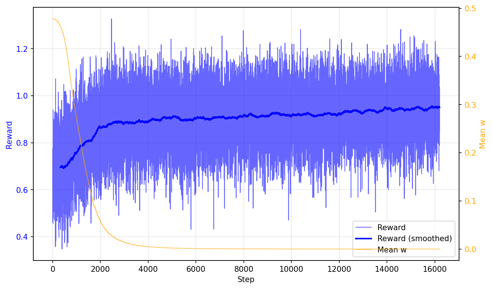

# PPO-LaMa: 基于PPO后处理的动漫图像修复细节增强

## 简介

本项目利用 PPO（近端策略优化，Proximal Policy Optimization）强化学习算法，对预训练的 **LaMa** 图像修复模型进行后处理微调，聚焦于**动漫图像修复**场景。通过引入可学习的细节增强强度控制机制，并设计多维度的奖励函数（涵盖 SSIM、PSNR、LPIPS、边缘保持度、频率一致性和锐度），使修复结果在纹理一致性、线条完整性和色彩适配性上达到更优平衡。


## 数据集

* **来源**：[Danbooru2024-SFW](https://huggingface.co/datasets/deepghs/danbooru2024-sfw/tree/main/images) 数据集，使用其中 0999、0777、0117 三个子集压缩包
* **数据划分**：训练集 70%、测试集 20%、验证集 10%（通过 txt 文件记录路径）
* **预处理流程**：

  1. 删除压缩包内的文件夹结构及 `.webp` 格式文件
  2. 统一转换其余图片格式为 JPG，并从 0001 开始重新命名
  3. 生成 `train.txt`、`test.txt`、`val.txt` 记录图片路径


## 预训练模型

* **LaMa** [**anime-manga-big-lama.pt**](https://huggingface.co/df1412/anime-big-lama)：作为基础修复骨干网络，所有参数**冻结**，仅提供初步修复结果
* **DetailEnhancer**：固定的多尺度细节增强模块，通过高斯核进行多尺度反锐化掩模，提取高频细节残差，**无训练参数**
* **StateEncoder**：4 层卷积网络 + 自适应平均池化 + 全连接层，将 $I\_{hat}$ 与掩码拼接后编码为 **256 维**状态特征向量


## 系统框架

系统由五个核心模块组成：

|模块|说明|参数状态|
|-|-|-|
|`LaMaWrapper`|加载预训练 LaMa TorchScript 模型，对加掩码图像进行初步修复|冻结|
|`DetailEnhancer`|多尺度细节增强，提取高频细节残差 |无参数|
|`StateEncoder`|状态编码器，卷积网络 + 池化 + FC，输出 256 维特征|冻结|
|`ActorCritic`|PPO 策略-价值网络，共享 MLP 后分叉为 Actor（输出 w）和 Critic（输出 V(s)）|**可训练**|
|`RewardComputer`|多维奖励函数计算|无参数|

**完整流程**：

1. **数据加载与掩码生成**：`InpaintingDataset` 将图像缩放至 256x256 并填充为正方形；`MaskGenerator` 根据图像梯度复杂度动态生成不规则掩码：

   * 复杂度高（细节丰富）→ 掩码面积小（1%\~5%），以矩形、圆形、椭圆为主
   * 复杂度低（平坦区域）→ 掩码面积大（5%\~11%），以长条形为主（长宽比 5:1\~10:1）
2. **LaMa 推理与状态编码**：LaMa 对加掩码图像进行初步修复，StateEncoder 编码为状态向量
3. **PPO 策略决策与增强**：ActorCritic 输出权重 w，控制 DetailEnhancer 的增强强度
4. **训练循环**：通过 Rollout 采集经验存入 ReplayBuffer，缓冲区充足时执行 PPO 更新（GAE 优势估计 + 裁剪代理目标 + 价值损失 + 熵正则）
5. **评估验证**：`eval.py` 加载最优模型，在验证集上计算各项指标并生成三合一对比图


## 操作说明

### 数据准备

1. 下载 [Danbooru2024-SFW](https://huggingface.co/datasets/deepghs/danbooru2024-sfw/tree/main/images) 数据集子集（0999、0777、0117）
2. 运行预处理脚本，清理文件夹结构和 .webp 文件，统一转换为 JPG 格式
3. 生成 `train.txt`、`test.txt`、`val.txt` 划分文件

### 训练

```bash
python train.py
```

训练过程中自动保存：

* 最优模型权重（基于平均奖励）
* 4 种训练曲线图（奖励收敛、损失曲线、质量曲线、细节曲线）
* 掩码图片与修复效果对比图
* `metrics\\\\\\\_history.json` 指标记录


### 评估

```bash
python eval.py
```

在验证集上加载最优模型，deterministic 模式运行，输出：

* Reward、SSIM、PSNR、LPIPS、w 等指标的均值与标准差
* w 值分布直方图
* 每个样本的横向三合一对比图（原图 / 加掩码 / 修复结果）


## 超参数设置

|参数项|数值|
|-|-|
|图像尺寸|256x256|
|Batch Size|16|
|PPO 学习率|2e-5|
|折扣因子 γ|0.9|
|GAE 参数 λ|0.95|
|PPO 裁剪阈值 ε|0.15|
|PPO 更新轮数|5|
|Mini-batch 大小|64|
|状态特征维度|256|
|缓冲区大小|4096|
|总训练 Epochs|13|


## 效果展示

### 验证集评估结果

|指标|数值|
|-|-|
|SSIM|**0.9675**|
|LPIPS|**0.0822**|
|w 均值|0.0007|

验证集表现显著优于训练集末端，模型输出稳定可靠。


### 修复效果定性分析

* **简单纹理区域**：修复效果自然连贯，掩码区域与周围图像融合度高
* **复杂语义区域**（面部特征、复杂图案）：仍存在纹理扭曲、结构混乱的问题
* **锐化现象**：训练过程中部分样本出现过度锐化导致的画风不一致，但 `eval.py` 评估时未复现

